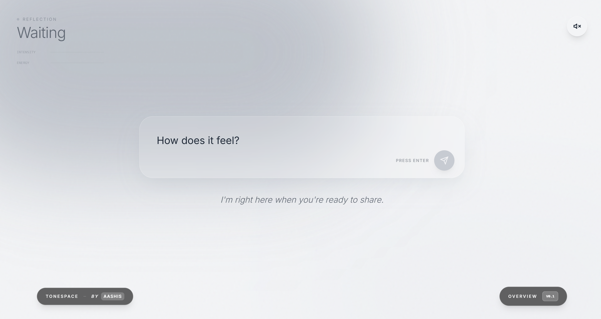

# ToneSpace

### **A Generative Mirror for the Human Emotions**

ToneSpace is an emotionally responsive digital environment that bridges the gap between abstract sentiment and tangible form. It translates your internal world expressed through text into a living landscape of color, generative sound, and motion.

---

## **The Concept**

In an age of cold data, **ToneSpace** brings warmth and intuition to the digital interface. It doesn't just process information; it *interprets* energy. By mapping the nuance of your words to emotional vectors, it creates a unique atmospheric signature for every moment.

### **Core Pillars**

*   🌈 **Iridescent Visuals**: GPU-accelerated SVG particles and procedural CSS gradients that breathe and shift in real-time.
*   🎵 **Sympathetic Audio**: A generative sound engine that crafts dynamic harmonic signatures using synthesis and ambient textures.
*   🧠 **Deep Emotional Analysis**: Powered by Google’s Gemini intelligence to distill text into intensity, energy, and mood.
*   🖋 **Reflective Minimalism**: A glassmorphic, high-contrast interface designed to let the emotional landscape remain the focus.

---

## **The Experience**

ToneSpace is designed for moments of reflection, focus, or raw expression. 

Whether you are seeking a moment of **Quiet Peace** (Nature Mode), navigating the storm of **Glitchy Confusion** (Chaos Mode), or basking in the warmth of **Kindness** (Love Mode), the interface adapts its weight, scale, and melody to mirror you.

---

### **Designed by AASHIS**
*A fusion of art, intelligence, and atmosphere.*
